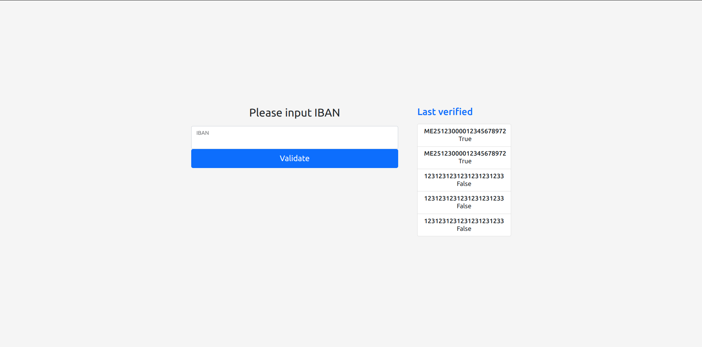
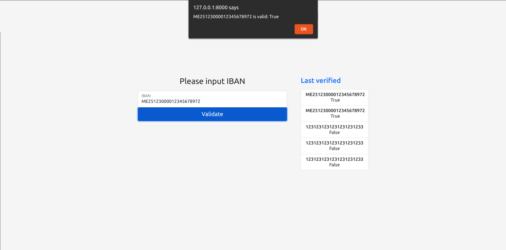

# me_iban_check

This project contains a simple django project to validate Montenegro IBAN.

## To run project:

- create a virtual environment
``python3 -m venv venv``
- activate environment
``source venv/bin/activate``
- apply migrations
``./manage.py migrate``
- run server
``./manage.py runsersver``
- go to your browser and open default page http://127.0.0.1:8000/
- input IBAN to check ``for ex. ME25123000012345678972``
## Interface examples 

